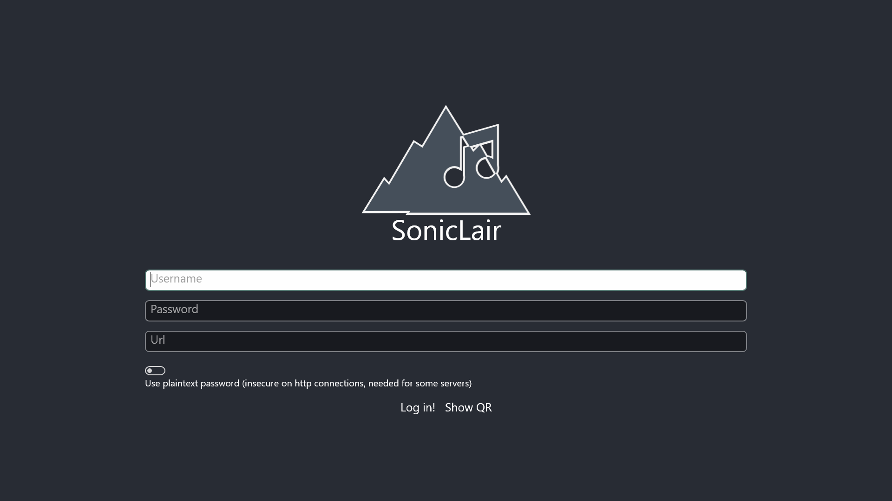
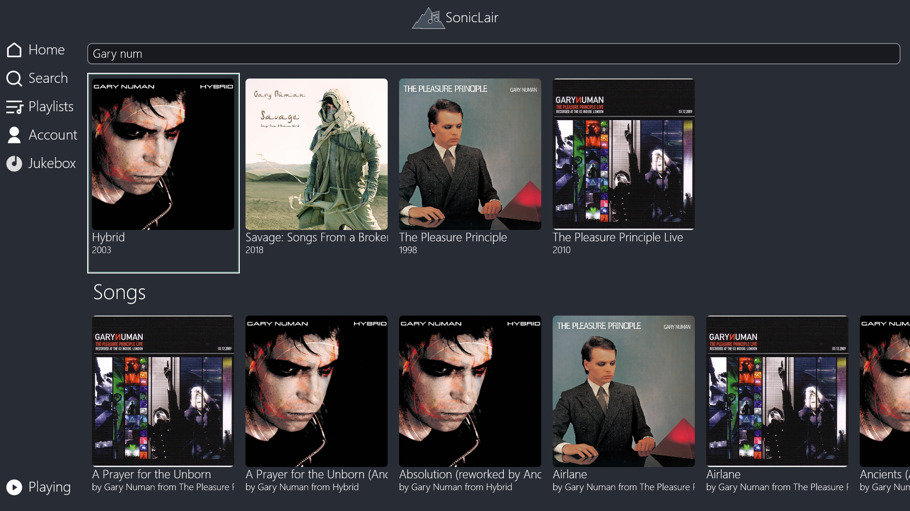
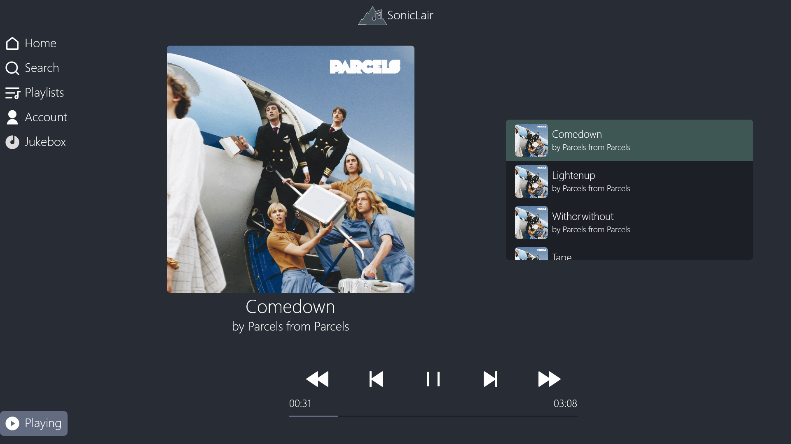
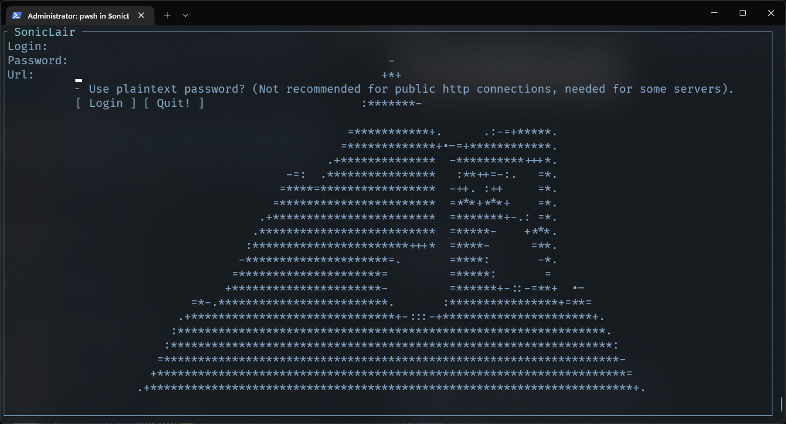
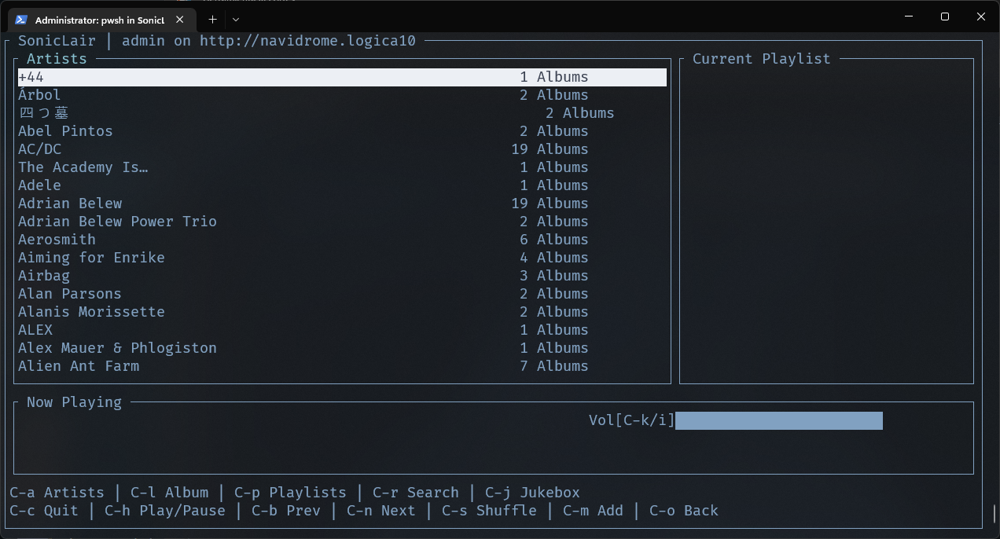
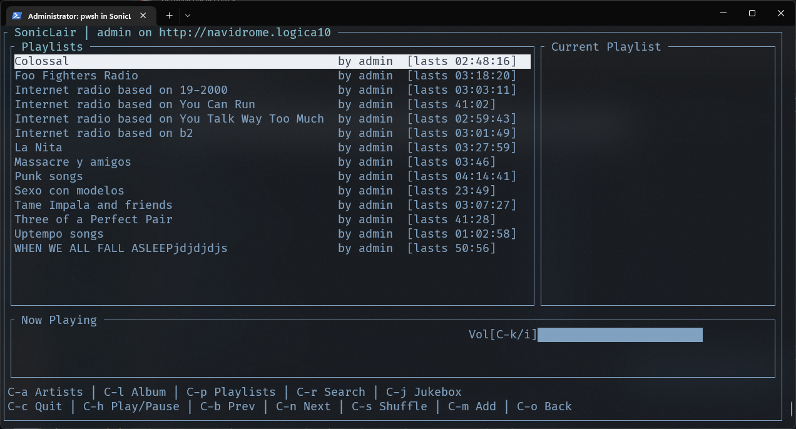
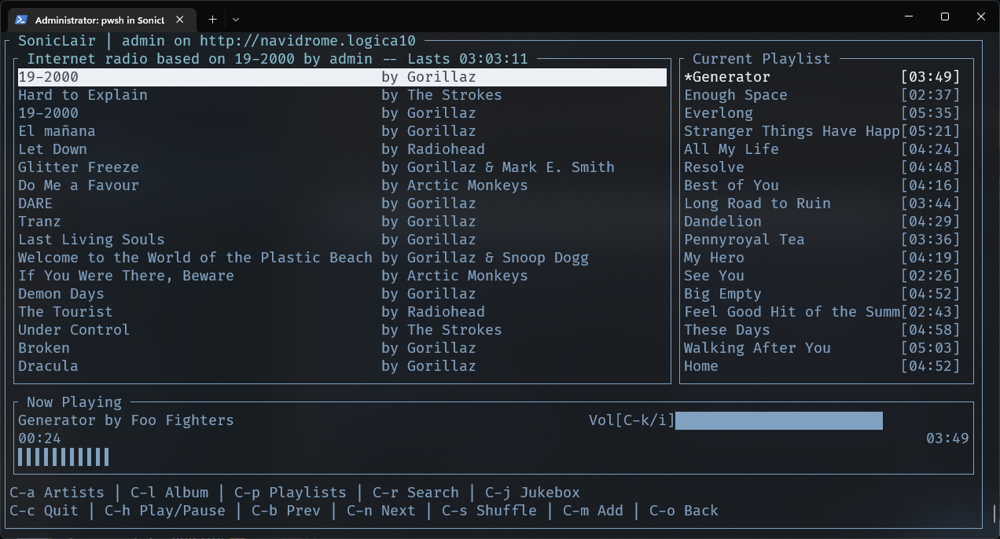
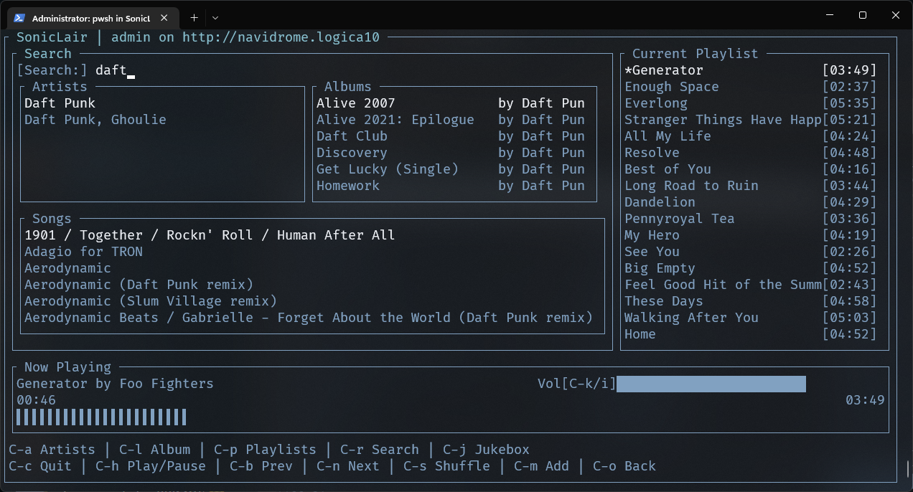

# Soniclair.NET

   

## An album-centered subsonic client for Xbox and the Terminal

SonicLair.NET is a minimal, album-centered music client for subsonic compatible music servers built using .net Core 6 and UWP, designed to run on Xbox and the terminal (Windows, Linux and macOS).

## Features

- Connect to any subsonic-compatible music server. Tested on Navidrome.
- Album-centered music playing: if you start playing a song, the album becomes your playlist.
- Start a radio based on any song on your library.
- Search throughout your entire music library.
- Connect your Xbox or terminal to your server using SonicLair on [your phone running Android](https://github.com/thelinkin3000/SonicLair) and a QR Code. (All the communications are made within the LAN, no third-party servers involved)
- Jukebox Mode! Run an instance of Soniclair in an Xbox or any computer with a terminal and control it from another instance running on Android.

## Screenshots for Xbox

## Screenshots for the Terminal

## Installation and Usage

### Xbox Retail Mode

### Xbox Developer Mode

I'm working on getting a pipeline on github actions to get signed bundles for installing on Xbox via the Device Portal. Soon!

### Terminal

The terminal version is an (almost) self contained executable. You can grab the version for your operating system from the releases page. Within the compressed file there is the excutable and (if applicable) the libvlc libraries needed for the audio backend to work. Please keep the directory structure as is.

### Linux caveats

For linux, the app will search for the relevant libvlc files from your installation.

For Ubuntu and Debian

    sudo apt update
    sudo apt upgrade (if you haven't done it in a while)
    sudo apt install libvlc-dev libx11-dev

And then you can try the app. If it complains that it can't instantiate libvlc try

    sudo apt install vlc

More info about this [here](https://github.com/videolan/libvlcsharp/blob/3.x/docs/linux-setup.md)

## Projects leveraged here

Soniclair is built upon

### Xbox

- [WinUI2]
- [WindowsCommunityToolkit] (used for a couple animations)

### Terminal

- [Terminal.GUI]

### Common

- [VLC] (as an audio backend)
- [Watson Websocket]
- [QR Coder]
- [Dillinger] (used to write this README)

## Contribute

I'm not planning on receiving contributions yet, although you can fork this repo at your heart's desire!
Soon, though.

## License

MIT, see LICENSE for more info.
But basically, you can do whatever you want with this code.

[//]: # "These are reference links used in the body of this note and get stripped out when the markdown processor does its job. There is no need to format nicely because it shouldn't be seen. Thanks SO - http://stackoverflow.com/questions/4823468/store-comments-in-markdown-syntax"
[winui2]: https://github.com/microsoft/microsoft-ui-xaml
[windowscommunitytoolkit]: https://github.com/CommunityToolkit/WindowsCommunityToolkit
[vlc]: https://www.videolan.org/
[dillinger]: https://github.com/joemccann/dillinger
[terminal.gui]: https://github.com/migueldeicaza/gui.cs
[watson websocket]: https://github.com/jchristn/WatsonWebsocket
[qr coder]: https://github.com/codebude/QRCoder
