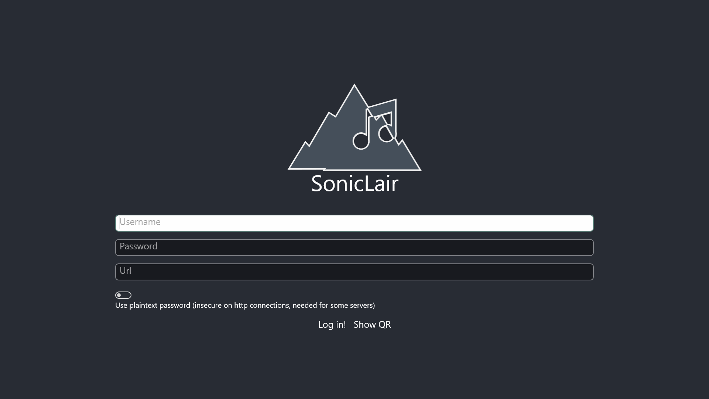
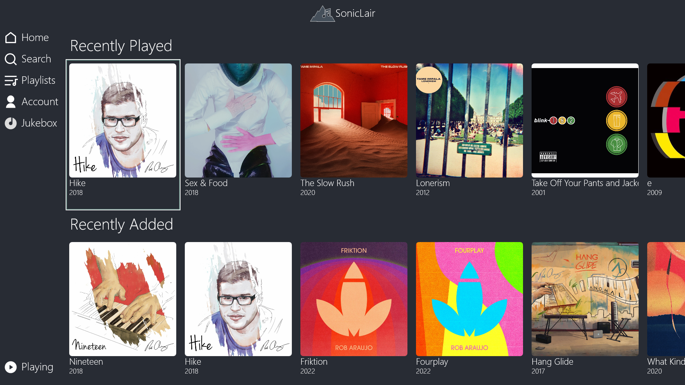
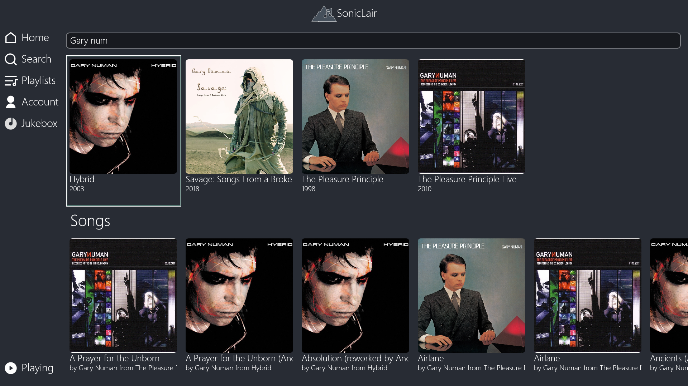
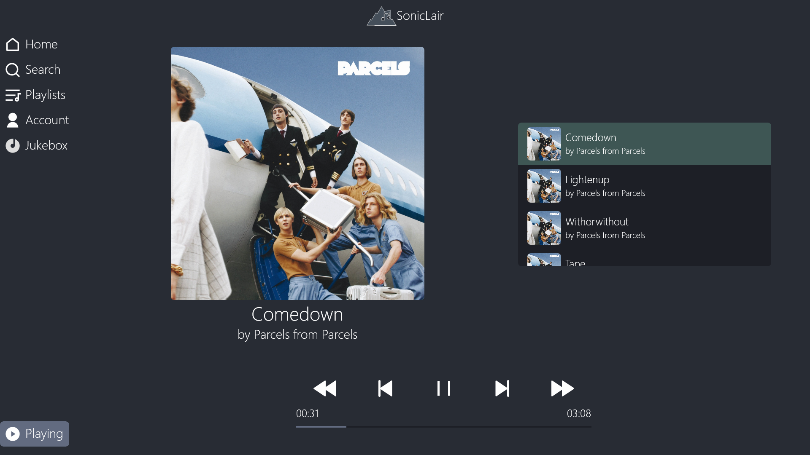
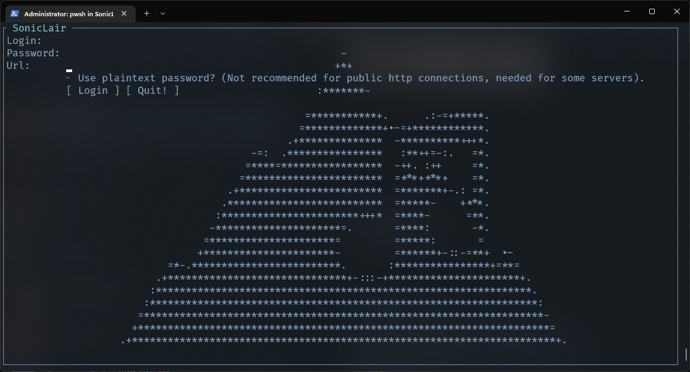
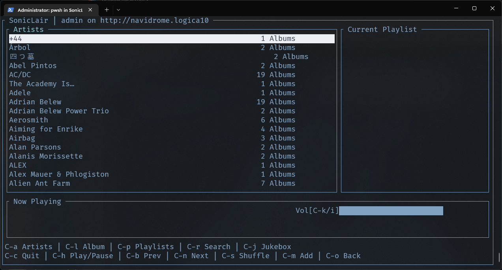
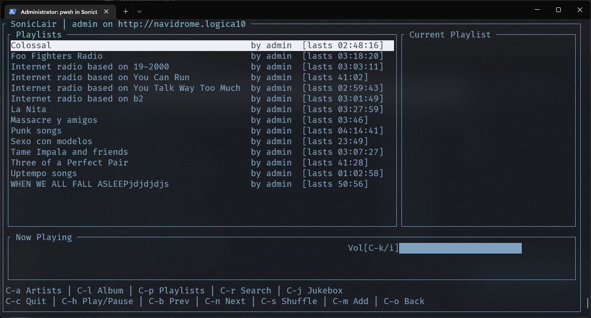
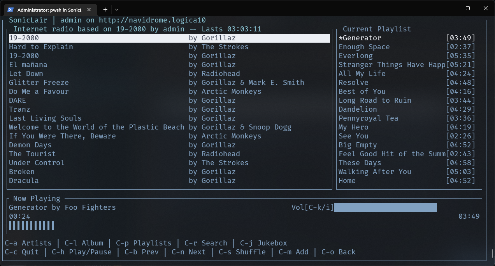
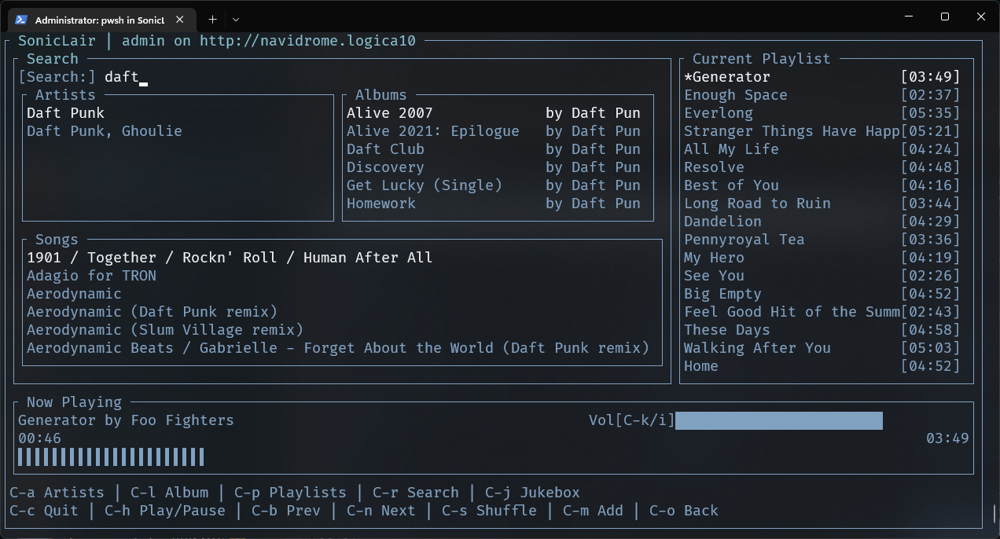

# Soniclair.NET

   

## An album-centered subsonic client for Xbox and the Terminal

SonicLair.NET is a minimal, album-centered music client for subsonic compatible music servers built using .net Core 6 and UWP, designed to run on Xbox and the terminal (Windows, Linux and macOS).

## Features

- Connect to any subsonic-compatible music server. Tested on Navidrome.
- Album-centered music playing: if you start playing a song, the album becomes your playlist.
- Start a radio based on any song on your library.
- Search throughout your entire music library.
- Connect your Xbox or terminal to your server using SonicLair on [your phone running Android](https://github.com/thelinkin3000/SonicLair) and a QR Code. (All the communications are made within the LAN, no third-party servers involved)
- Jukebox Mode! Run an instance of Soniclair in an Xbox or any computer with a terminal and control it from another instance running on Android.
- On Linux, playback shows up in your desktop's media controls (GNOME Shell, KDE Plasma, Waybar, `playerctl`, etc.) via MPRIS2 support, so you can play/pause/skip and see the current track without switching back to the terminal.

## Screenshots for Xbox

## Screenshots for the Terminal

## Installation and Usage

### Xbox Retail Mode

### Xbox Developer Mode

I'm working on getting a pipeline on github actions to get signed bundles for installing on Xbox via the Device Portal. Soon!

### Terminal

The terminal version is an (almost) self contained executable. You can grab the version for your operating system from the releases page. Within the compressed file there is the excutable and (if applicable) the libvlc libraries needed for the audio backend to work. Please keep the directory structure as is.

### Linux caveats

On Linux, the app defaults to an `mpv`-based audio backend (via `libmpv`), which has proven more reliable than VLC across distros and architectures (including ARM). You'll need `libmpv` installed:

For Ubuntu and Debian

    sudo apt update
    sudo apt upgrade (if you haven't done it in a while)
    sudo apt install libmpv2

If you'd rather use the VLC backend on Linux (e.g. to compare, or if you run into an mpv issue), pass `--vlc` on the command line. The app will then search for the relevant libvlc files from your installation.

For Ubuntu and Debian

    sudo apt install libvlc-dev libx11-dev

And then you can try the app. If it complains that it can't instantiate libvlc try

    sudo apt install vlc vlc-plugin-base

(`vlc-plugin-base` provides the actual audio codec/output plugins; without it, libvlc can load but fails to produce sound or play most files.)

More info about libvlc on Linux [here](https://github.com/videolan/libvlcsharp/blob/3.x/docs/linux-setup.md)

Regardless of the audio backend, the terminal app also exposes an MPRIS2 player (`org.mpris.MediaPlayer2.soniclair`) on the session D-Bus, so any standard media-control widget can see and control it. No extra setup needed; if there's no session bus available (e.g. over a bare SSH session) it's simply skipped.

### Command-line flags

- `-h`: run headless (no terminal UI), controllable via the websocket API / a paired phone.
- `--mpv`: force the mpv audio backend (default on Linux already).
- `--vlc`: force the VLC audio backend (default on Windows/macOS; opt-in override on Linux).

## Projects leveraged here

Soniclair is built upon

### Xbox

- [WinUI2]
- [WindowsCommunityToolkit] (used for a couple animations)

### Terminal

- [Terminal.GUI]
- [Tmds.DBus] (MPRIS2 media control support on Linux)

### Common

- [VLC] (audio backend on Windows/macOS, and on Linux via `--vlc`)
- [mpv] (default audio backend on Linux, via `libmpv`)
- [Watson Websocket]
- [QR Coder]
- [Dillinger] (used to write this README)

## Contribute

I'm not planning on receiving contributions yet, although you can fork this repo at your heart's desire!
Soon, though.

## License

MIT, see LICENSE for more info.
But basically, you can do whatever you want with this code.

[//]: # "These are reference links used in the body of this note and get stripped out when the markdown processor does its job. There is no need to format nicely because it shouldn't be seen. Thanks SO - http://stackoverflow.com/questions/4823468/store-comments-in-markdown-syntax"
[winui2]: https://github.com/microsoft/microsoft-ui-xaml
[windowscommunitytoolkit]: https://github.com/CommunityToolkit/WindowsCommunityToolkit
[vlc]: https://www.videolan.org/
[mpv]: https://mpv.io/
[dillinger]: https://github.com/joemccann/dillinger
[terminal.gui]: https://github.com/migueldeicaza/gui.cs
[tmds.dbus]: https://github.com/tmds/Tmds.DBus
[watson websocket]: https://github.com/jchristn/WatsonWebsocket
[qr coder]: https://github.com/codebude/QRCoder
